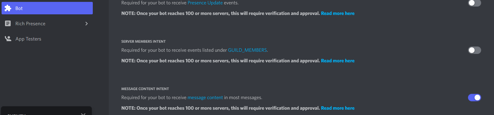

We hebben onze bot van vorige keer, nu gaan we een spelletje erbij maken

## haiku function
In je bot file maak je een nieuwe function aan:

```python
async def haiku(channel):
    await channel.send("Hier komt een haiku")
```
Deze hebben we straks nodig

channel komt straks uit je message

## Message content mogen lezen:

om bij de mesage content te mogen, moeten we dit aangeven.
Voeg de `intents.message_content` toe:

```python
intents.messages= True
intents.message_content = True #deze is nieuw
client = discord.Client(intents=intents)
```

In je `discord developer portal` onder jouw app, moet je naar je bot gaan en `Message Content Intent` aanzetten:



## !haiku commando
In je bot heb je een stuk code om op messages te reageren:

```python
@client.event
async def on_message(message):
    print(message.channel.name, "the message was posted from this channel")
    print(message.content)
    print(message.author,"is the user who wrote the message")
    print(message.created_at,"is when the message was posted")
    print(message.channel,"is the channel this message was posted in")
```
Maak hier nu een `if statement` waarbij je de `message.content` test op: `!haiku` AND `message.author.bot == False`

Als dat zo is (True) roep dan de `haiku functie` aan:
```python
haiku(message.channel)
```

## Haiku files inladen

Maak nu 2 tekst files aan:

* haiku5.txt
* haiku7.txt

zet in haiku5.txt regels met 5 syllables
zet in haiku7.txt regels met 7 syllables

haal deze bijvoorbeeld uit:
- An old silent pond...
- A frog jumps into the pond,
- splash! Silence again.

- Autumn moonlight-
- a worm digs silently
- into the chestnut.

- In the twilight rain
- these brilliant-hued hibiscus -
- A lovely sunset.


nu maken gaan we die files lezen en maken we `2 variablen` aan om de gelezen content in op te slaan:
zet deze `boven aan` in je bot python file

```python
def readLines(file):
    f = open(file, "r")
    lines = f.readlines()
    f.close()#deze is belangrijk weet jij waarom?
    return lines

haiku5 = readLines("haiku5.txt")
haiku7 = readLines("haiku7.txt")
```

## Haiku function uitbreiden:

Nu moeten we nog wel de haiku kiezen en schrijven naar de chat.
Voeg boven aan je file bij de imports `import random` toe en pas de haiku function aan:


```python
async def haiku(channel):
    
    line1 = random.choice(haiku5)
    #hier de 2 anderen selecteren

    await channel.send(line1)
    #hier de 2 ook chatten
```


## Challenge:

Maak nog twee extra commando's om de 2 verschillende haiku regels toe te voegen:
* !haiku5 
* !haiku7
Hiervoor moet je dus wat de gebruiker typed bij de haiku5 of haiku7 lijst toevoegen met `append(...)`.
bv:

En misschien zelfs naar de files schrijven (maar dan moet je aan security gaan denken ^^)


## Klaar! Je werk op Github zetten

Zorg er voor dat je alles wat je hebt gemaakt commit en naar Github pusht, zodat duidelijk is wat je hebt gedaan en hoe ver je bent gekomen. Hier lees je hoe je dat doet.

[Je werk *committen* en *pushen* naar Github](../../00-setup/commit_push.html){:class="next"}

> Vergeet niet je token weg te halen

> Dit was wel een flinke opdracht en best ingewikkeld. Dus neem je tijd om er aan te werken.
 
> Vraag om hulp tijdens de Flex Python Extra lessen als je vastloopt! 